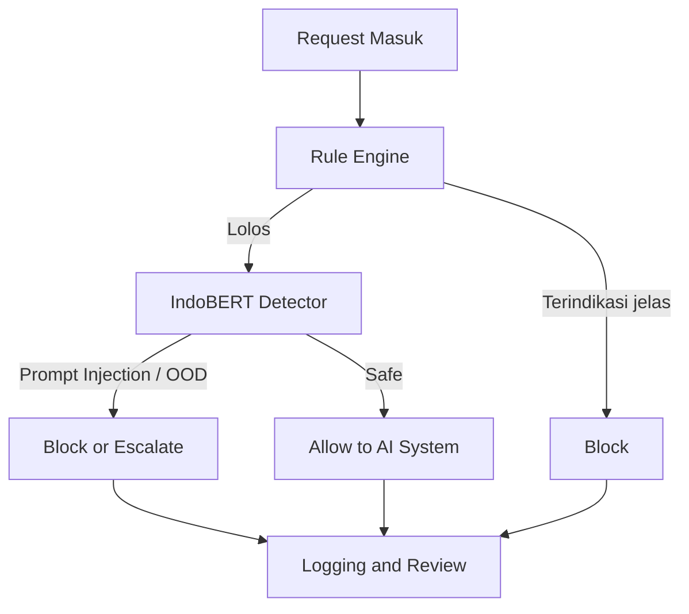

---
tags:
  - bab4
  - draft
  - skripsi
  - samaryn
  - rpld
---

# Bab 4 Hasil Penelitian dan Pembahasan Samaryn Draft

## Acuan panduan

Sesuai panduan TA Unimus untuk `RPLD dan KKI`, Bab IV berisi:
- rancangan sistem
- implementasi
- hasil penelitian
- pembahasan

## 4.1 Rancangan Sistem

Bagian ini menjelaskan desain [[Samaryn AI Security Gateway]] berdasarkan metode penelitian pada [[Bab 3 Metodologi Samaryn Draft]].

### Komponen rancangan

| Komponen | Fungsi |
|---|---|
| Rule Engine | menyaring pola eksplisit seperti override instruction, ignore previous instruction, atau prompt manipulatif sederhana |
| IndoBERT Detector | mengklasifikasikan request menjadi aman, berisiko, atau out-of-domain |
| Escalation Layer | menangani kasus ambigu melalui review lanjutan atau detector tambahan |
| Logging Module | menyimpan request, hasil klasifikasi, dan alasan keputusan |
| Response Router | meneruskan atau menahan request berdasarkan hasil deteksi |

### Alur sistem

1. Request diterima dari pengguna atau sumber eksternal.
2. Rule engine melakukan pemeriksaan awal.
3. Jika lolos, request dikirim ke [[IndoBERT]] detector.
4. Detector menghasilkan label dan skor keyakinan.
5. Sistem memutuskan `allow`, `block`, atau `escalate`.
6. Hasil disimpan ke log untuk evaluasi dan audit.

### Diagram alur logika

## 4.2 Implementasi

Bagian ini menjelaskan implementasi rancangan sistem ke bentuk perangkat lunak atau prototipe penelitian.

### Implementasi minimum yang feasible

| Modul | Implementasi awal |
|---|---|
| preprocessing | normalisasi teks, lowercasing seperlunya, pembersihan karakter tidak relevan |
| rule engine | daftar pola prompt injection dasar |
| detector | fine-tuned [[IndoBERT]] classifier |
| routing | logika if-else berdasarkan threshold |
| logging | penyimpanan input, label prediksi, skor, dan keputusan |

### Output sistem

- label klasifikasi
- confidence score
- keputusan gateway
- catatan log

## 4.3 Hasil Penelitian

Bagian ini diisi dengan hasil uji coba sistem atau detector yang telah diimplementasikan.

### Tabel hasil evaluasi yang disarankan

| Skenario uji | Metric | Hasil |
|---|---|---|
| in-domain safe prompts | accuracy / recall | ... |
| prompt injection samples | precision / recall / F1 | ... |
| out-of-domain samples | macro F1 / AUROC / FPR | ... |
| mixed deployment set | overall accuracy / miss rate | ... |

### Tabel confusion matrix sederhana

| Actual \\ Predicted | Safe | Prompt Injection | OOD |
|---|---|---|---|
| Safe | ... | ... | ... |
| Prompt Injection | ... | ... | ... |
| OOD | ... | ... | ... |

## 4.4 Pembahasan

Bagian ini menafsirkan hasil eksperimen dan menjawab apakah sistem memenuhi tujuan penelitian.

### Arah pembahasan

- Apakah detector mampu membedakan input normal dan berbahaya?
- Apakah OOD detection membantu mengurangi request ambigu?
- Pada kondisi apa false positive paling sering muncul?
- Pada kondisi apa false negative paling berbahaya?
- Seberapa berguna rule engine dibanding classifier?
- Apakah arsitektur gateway berlapis lebih masuk akal daripada detector tunggal?

### Hubungan dengan rumusan masalah

| Rumusan masalah | Cara dijawab di Bab IV |
|---|---|
| bagaimana merancang engine deteksi berbasis [[IndoBERT]] | dijawab pada rancangan sistem dan implementasi |
| bagaimana mengintegrasikan detector ke [[Samaryn AI Security Gateway]] | dijawab pada arsitektur dan routing keputusan |
| bagaimana mengevaluasi performa detector | dijawab pada hasil penelitian dan pembahasan metric |

## Terkait

- [[Bab 3 Metodologi Samaryn Draft]]
- [[Bab 2 Tinjauan Pustaka Samaryn Tabel]]
- [[Variabel dan Instrumen Evaluasi Samaryn]]

