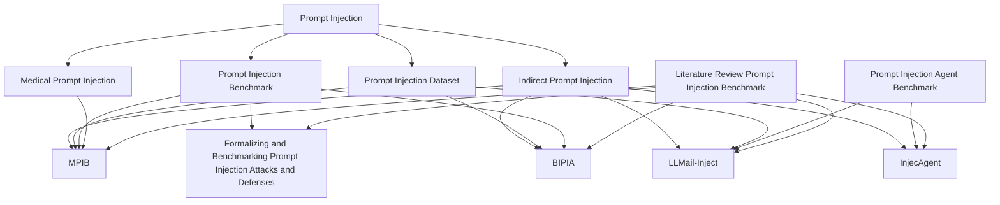

---
tags:
  - prompt-injection
  - benchmark
  - dataset
---

# Prompt Injection Benchmark Graph

Note utama untuk navigasi paper, dataset, dan benchmark tentang [[Prompt Injection]].

## Peta visual

## Konsep inti

- [[Prompt Injection]]
- [[Indirect Prompt Injection]]
- [[Prompt Injection Dataset]]
- [[Prompt Injection Benchmark]]
- [[Prompt Injection Agent Benchmark]]
- [[Medical Prompt Injection]]
- [[Samaryn AI Security Gateway]]
- [[IndoBERT]]
- [[Out-of-Domain Detection]]

## Paper utama

- [[LLMail-Inject]]
- [[BIPIA]]
- [[InjecAgent]]
- [[Formalizing and Benchmarking Prompt Injection Attacks and Defenses]]
- [[MPIB]]
- [[Literature Review Prompt Injection Benchmark]]

## Rekomendasi urutan baca

1. [[LLMail-Inject]]
2. [[BIPIA]]
3. [[InjecAgent]]
4. [[Formalizing and Benchmarking Prompt Injection Attacks and Defenses]]
5. [[MPIB]]

## Ringkas beda fokus

- [[LLMail-Inject]] -> dataset realistis dan adaptif.
- [[BIPIA]] -> benchmark foundational untuk [[Indirect Prompt Injection]].
- [[InjecAgent]] -> benchmark untuk agent + tools.
- [[Formalizing and Benchmarking Prompt Injection Attacks and Defenses]] -> framework evaluasi umum.
- [[MPIB]] -> benchmark domain medis dengan fokus safety.

## Note turunan

- [[Literature Review Prompt Injection Benchmark]]
- [[Prompt Injection Reading Notes]]
- [[Research Gap Prompt Injection]]
- [[Related Work Prompt Injection]]
- [[Paper Review Template]]
- [[Samaryn Security Reading List]]
- [[Samaryn Literature Review Draft]]
- [[Samaryn Formal Related Work Draft]]
- [[Samaryn Paper Review Matrix]]
- [[Bab 1 Latar Belakang Samaryn Draft]]
- [[Bab 2 Tinjauan Pustaka Samaryn Tabel]]
- [[Bab 3 Metodologi Samaryn Draft]]
- [[Bab 4 Hasil Penelitian dan Pembahasan Samaryn Draft]]
- [[Samaryn Dataset Benchmark Mapping]]
- [[Judul Penelitian Samaryn]]
- [[Checklist TA Unimus untuk Samaryn]]
- [[Variabel dan Instrumen Evaluasi Samaryn]]
